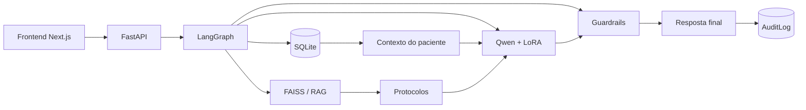

# Medical Assistant

Assistente clínico baseado em IA para apoio ao acompanhamento de pacientes com hipertensão arterial.

Projeto desenvolvido na Pós-Graduação em **IA para Devs**, com foco em integração de LLM, fine-tuning, RAG, LangChain, LangGraph, segurança e rastreabilidade.

> Projeto acadêmico. Não substitui avaliação, diagnóstico ou decisão de um profissional de saúde.

---

## Tecnologias

### Backend
- Python
- FastAPI
- SQLAlchemy
- SQLite
- Pydantic

### IA e Orquestração
- LangChain
- LangGraph
- Hugging Face Transformers
- PEFT / QLoRA
- Qwen2.5-1.5B-Instruct
- FAISS
- sentence-transformers

### Frontend
- Next.js
- TypeScript
- Tailwind CSS
- Lucide React
- React Markdown

### Gerenciamento
- uv
- npm

---

## Arquitetura



O sistema combina:

- dados estruturados do paciente no SQLite;
- recuperação semântica de protocolos com FAISS;
- LLM fine-tuned com QLoRA;
- fluxo orquestrado com LangGraph;
- guardrails e validação humana;
- auditoria de cada consulta.

---

## Estrutura principal

```text
medical-assistant/
├── backend/
│   └── medical_assistant/
├── frontend/
├── training/
├── scripts/
├── data/
├── artifacts/
├── docs/
├── pyproject.toml
└── README.md
```

---

## Setup

### Pré-requisitos

- Python 3.12+
- uv
- Node.js
- npm
- Git

Na raiz do projeto:

```bash
uv run python scripts/setup_project.py
```

O setup completo:

- instala dependências Python, incluindo treinamento;
- instala dependências do frontend;
- cria o `.env`;
- baixa os subconjuntos utilizados do MedQuAD;
- prepara os datasets;
- inicializa o SQLite;
- popula pacientes sintéticos;
- gera o vector store FAISS.

Para preparar apenas o necessário para executar a aplicação:

```bash
uv run python scripts/setup_project.py --runtime-only
```

Outras opções:

```bash
uv run python scripts/setup_project.py --reset
```

```bash
uv run python scripts/setup_project.py --rebuild-vector-store
```

```bash
uv run python scripts/setup_project.py --refresh-medquad
```

---

## Execução

### Backend

```bash
uv run uvicorn medical_assistant.main:app --reload
```

API:

```text
http://127.0.0.1:8000
```

Swagger:

```text
http://127.0.0.1:8000/docs
```

### Frontend

```bash
cd frontend
npm run dev
```

Aplicação:

```text
http://localhost:3000
```

---

## Fine-tuning

Modelo base:

```text
Qwen/Qwen2.5-1.5B-Instruct
```

O treinamento utiliza **QLoRA/LoRA** com dados do MedQuAD e exemplos sintéticos.

Executar:

```bash
uv run python -m training.train
```

Adapter gerado:

```text
artifacts/models/hypertension-assistant/
```

Avaliação:

```bash
uv run python -m training.evaluate
```

---

## RAG

Os protocolos internos ficam em:

```text
data/raw/protocols/
```

O índice vetorial pode ser reconstruído com:

```bash
uv run python scripts/build_vector_store.py
```

Tecnologias utilizadas:

```text
Markdown
   ↓
Text Splitter
   ↓
sentence-transformers
   ↓
FAISS
   ↓
LangChain Retriever
```

---

## LangGraph

O fluxo principal executa etapas como:

```text
load_patient
    ↓
check_blood_pressure
    ↓
check_pending_exams
    ↓
retrieve_protocols
    ↓
build_clinical_context
    ↓
generate_summary
    ↓
safety_validation
    ↓
save_audit_log
```

---

## API principal

### Pacientes

```http
GET /patients
GET /patients/{patient_id}
```

### Assistente

```http
POST /assistant/chat
```

Exemplo:

```json
{
  "patient_id": 2,
  "question": "Analise a situação atual deste paciente."
}
```

### Auditoria

```http
GET /audit
GET /audit/{audit_id}
GET /audit/patient/{patient_id}
```

---

## Segurança

O sistema foi desenvolvido como ferramenta de apoio à decisão.

Foram implementados:

- guardrails;
- bloqueio de prescrição automática;
- validação de respostas;
- classificação de segurança;
- fontes recuperadas;
- logging e auditoria;
- validação humana obrigatória.

---

## Interface

O frontend permite:

- visualizar pacientes;
- consultar prontuário;
- visualizar pressão arterial;
- visualizar medicamentos e exames;
- consultar o assistente;
- visualizar fontes;
- acompanhar status de segurança;
- consultar histórico de auditoria.

---

## Autor

**Jonas Euler Paulino de Queiroz**  
Pós-Graduação em **IA para Devs**
